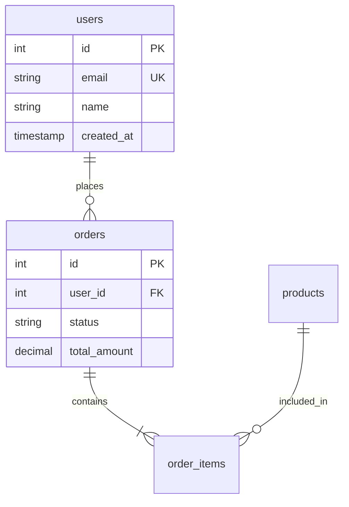
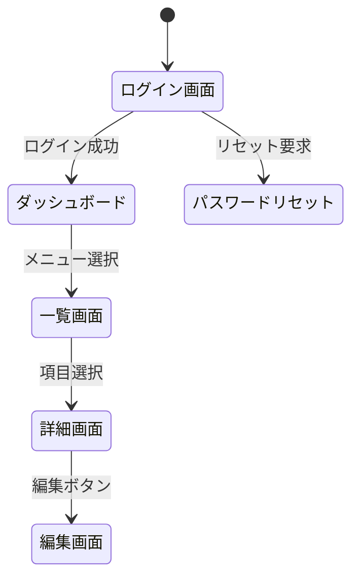
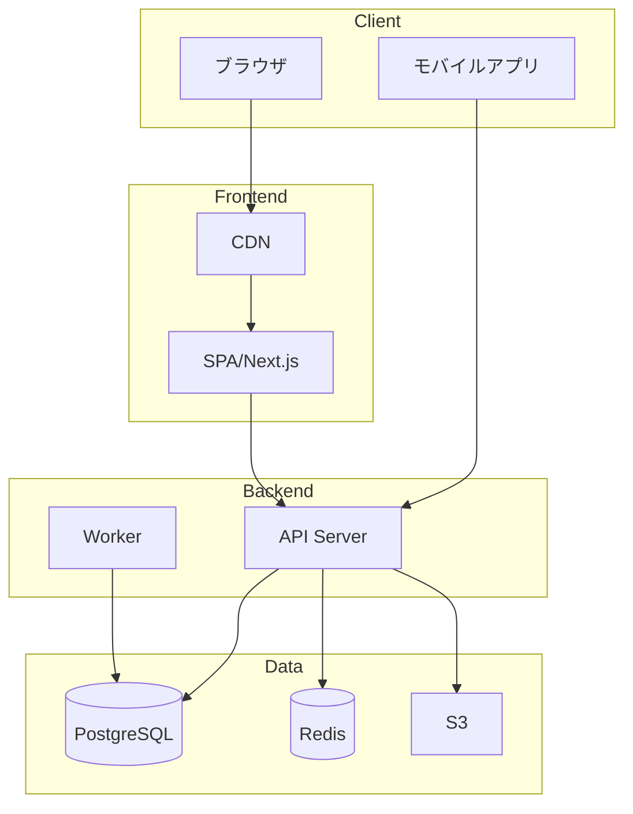
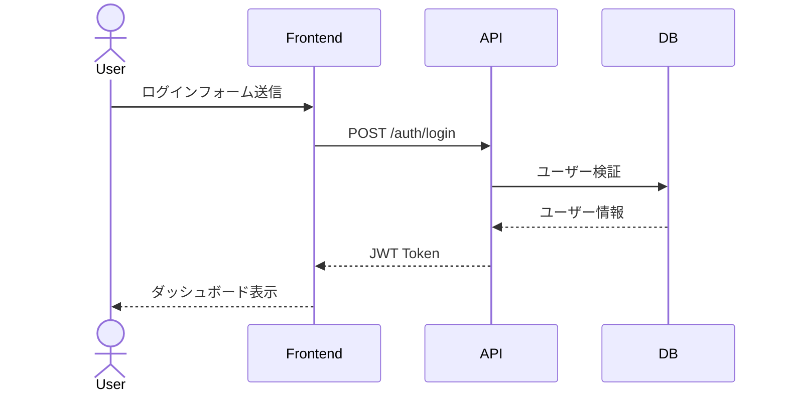

# 基本設計スキル

## 概要

要件定義に基づき、ソフトウェアの基本設計書を作成する。

**作成可能な成果物:**
- 画面設計（画面一覧、画面遷移図、ワイヤーフレーム）
- データ設計（ER図、テーブル定義書）
- API設計（エンドポイント一覧、リクエスト/レスポンス仕様）
- アーキテクチャ設計（システム構成図、コンポーネント図）

## ワークフロー

```
[入力確認] → [設計方針決定] → [各設計作成] → [整合性確認] → [出力]
```

### Phase 1: 入力確認

以下の情報を確認・収集する：

| 必須項目 | 説明 |
|---------|------|
| 要件定義 | 機能要件・非機能要件の一覧 |
| 技術スタック | フロントエンド、バックエンド、DB |
| 対象範囲 | 作成する設計書の種類 |

要件定義が不明確な場合、`requirements-definition`スキルの使用を提案する。

### Phase 2: 設計方針決定

システム特性に応じた設計方針を決定する。

**アーキテクチャパターン:**
- モノリシック / マイクロサービス
- MVC / クリーンアーキテクチャ / レイヤードアーキテクチャ
- REST API / GraphQL

**命名規則:**
- テーブル名: snake_case（複数形）
- カラム名: snake_case
- API: RESTful命名規則
- 画面ID: SCRN-XXX形式

### Phase 3: 各設計の作成

対象範囲に応じて以下を作成する。詳細は`references/`を参照。

| 設計種別 | リファレンス |
|---------|-------------|
| 画面設計 | `references/screen-design.md` |
| データ設計 | `references/data-design.md` |
| API設計 | `references/api-design.md` |
| アーキテクチャ設計 | `references/architecture-design.md` |

### Phase 4: 整合性確認

設計間の整合性を確認する：

- 画面項目とAPI項目の対応
- APIレスポンスとテーブル項目の対応
- 画面遷移とAPIエンドポイントの対応

---

## 出力フォーマット

### 基本設計書の構成

```markdown
# 基本設計書: {システム名}

## 1. 設計概要
- システム概要
- 設計方針
- 技術スタック
- 前提条件・制約

## 2. アーキテクチャ設計
- システム構成図
- コンポーネント図
- 技術選定理由

## 3. 画面設計
- 画面一覧
- 画面遷移図
- 画面レイアウト（主要画面）

## 4. データ設計
- ER図
- テーブル定義書
- マスターデータ一覧

## 5. API設計
- API一覧
- エンドポイント詳細
- 共通仕様（認証、エラー形式等）

## 6. 非機能設計
- セキュリティ設計
- パフォーマンス設計
- 可用性設計

## 付録
- 用語集
- 参考資料
```

---

## Mermaid記法ガイド

設計図はMermaid記法で出力する。

### ER図



### 画面遷移図



### システム構成図



### シーケンス図



---

## リファレンス

- `references/screen-design.md` - 画面設計の詳細ガイド
- `references/data-design.md` - データ設計の詳細ガイド
- `references/api-design.md` - API設計の詳細ガイド
- `references/architecture-design.md` - アーキテクチャ設計の詳細ガイド
