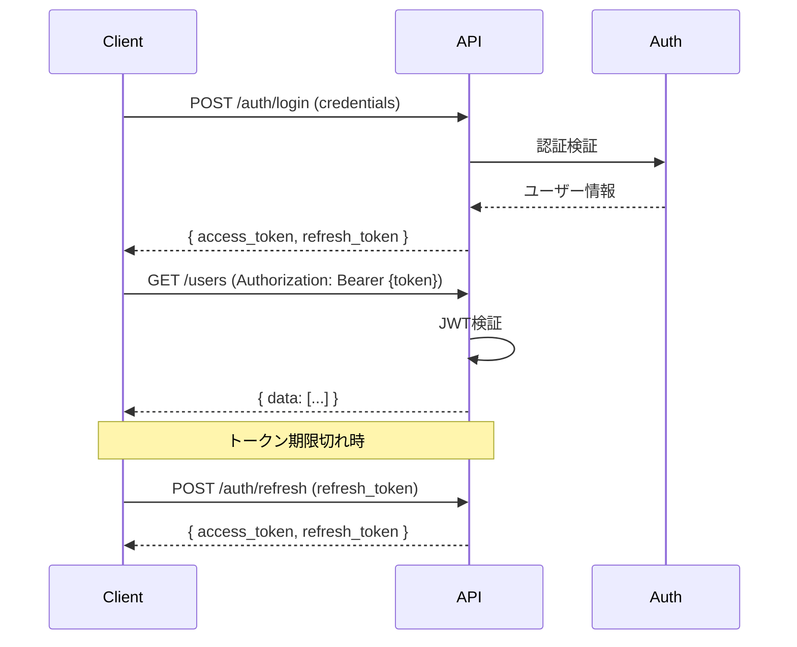

# API設計リファレンス

## 1. API一覧

### テンプレート

| No | メソッド | エンドポイント | 概要 | 認証 | 権限 |
|----|----------|---------------|------|------|------|
| 1 | POST | /auth/login | ログイン | 不要 | - |
| 2 | POST | /auth/logout | ログアウト | 必要 | 全員 |
| 3 | GET | /users | ユーザー一覧取得 | 必要 | admin |
| 4 | GET | /users/{id} | ユーザー詳細取得 | 必要 | admin, self |
| 5 | POST | /users | ユーザー作成 | 必要 | admin |
| 6 | PUT | /users/{id} | ユーザー更新 | 必要 | admin, self |
| 7 | DELETE | /users/{id} | ユーザー削除 | 必要 | admin |

---

## 2. エンドポイント詳細

### テンプレート

**API-001: ユーザー一覧取得**

| 項目 | 値 |
|------|-----|
| メソッド | GET |
| パス | /api/v1/users |
| 認証 | Bearer Token |
| 権限 | admin |

**リクエスト**

| パラメータ | 位置 | 型 | 必須 | 説明 | 例 |
|-----------|------|-----|------|------|-----|
| page | query | integer | - | ページ番号 | 1 |
| per_page | query | integer | - | 1ページあたり件数 | 20 |
| status | query | string | - | ステータスフィルタ | active |
| q | query | string | - | 検索キーワード | yamada |
| sort | query | string | - | ソート項目 | created_at |
| order | query | string | - | 昇順/降順 | desc |

**レスポンス（200 OK）**

```json
{
  "data": [
    {
      "id": 1,
      "email": "user@example.com",
      "name": "山田太郎",
      "status": "active",
      "created_at": "2024-01-15T10:30:00Z"
    }
  ],
  "meta": {
    "current_page": 1,
    "per_page": 20,
    "total_count": 150,
    "total_pages": 8
  }
}
```

**エラーレスポンス**

| ステータス | コード | 説明 |
|-----------|--------|------|
| 401 | UNAUTHORIZED | 認証エラー |
| 403 | FORBIDDEN | 権限不足 |

---

## 3. RESTful設計規則

### HTTPメソッド

| メソッド | 操作 | べき等性 | 安全性 |
|----------|------|----------|--------|
| GET | 取得 | ○ | ○ |
| POST | 作成 | × | × |
| PUT | 全体更新 | ○ | × |
| PATCH | 部分更新 | ○ | × |
| DELETE | 削除 | ○ | × |

### URL設計

```
# コレクション
GET    /users          # 一覧取得
POST   /users          # 新規作成

# リソース
GET    /users/{id}     # 詳細取得
PUT    /users/{id}     # 更新
DELETE /users/{id}     # 削除

# ネストリソース
GET    /users/{id}/orders        # ユーザーの注文一覧
POST   /users/{id}/orders        # ユーザーの注文作成

# アクション（非CRUD操作）
POST   /users/{id}/activate      # 有効化
POST   /orders/{id}/cancel       # キャンセル
```

### クエリパラメータ

```
# ページネーション
?page=1&per_page=20

# フィルタリング
?status=active&category_id=5

# ソート
?sort=created_at&order=desc

# 検索
?q=keyword

# フィールド選択
?fields=id,name,email

# 関連リソース展開
?include=orders,address
```

---

## 4. 共通仕様

### リクエストヘッダー

| ヘッダー | 値 | 必須 | 説明 |
|----------|-----|------|------|
| Content-Type | application/json | ○ | リクエストボディ形式 |
| Accept | application/json | - | レスポンス形式 |
| Authorization | Bearer {token} | △ | 認証トークン |
| X-Request-ID | UUID | - | リクエスト追跡ID |

### レスポンスヘッダー

| ヘッダー | 値 | 説明 |
|----------|-----|------|
| Content-Type | application/json | レスポンスボディ形式 |
| X-Request-ID | UUID | リクエスト追跡ID |
| X-RateLimit-Limit | 1000 | レート制限上限 |
| X-RateLimit-Remaining | 999 | 残りリクエスト数 |

---

## 5. レスポンス形式

### 成功レスポンス

**単一リソース:**
```json
{
  "data": {
    "id": 1,
    "name": "山田太郎",
    "email": "yamada@example.com"
  }
}
```

**コレクション:**
```json
{
  "data": [
    { "id": 1, "name": "山田太郎" },
    { "id": 2, "name": "佐藤花子" }
  ],
  "meta": {
    "current_page": 1,
    "per_page": 20,
    "total_count": 100,
    "total_pages": 5
  },
  "links": {
    "self": "/users?page=1",
    "next": "/users?page=2",
    "last": "/users?page=5"
  }
}
```

### エラーレスポンス

```json
{
  "error": {
    "code": "VALIDATION_ERROR",
    "message": "入力内容に問題があります",
    "details": [
      {
        "field": "email",
        "code": "INVALID_FORMAT",
        "message": "メールアドレスの形式が正しくありません"
      },
      {
        "field": "password",
        "code": "TOO_SHORT",
        "message": "パスワードは8文字以上必要です"
      }
    ]
  }
}
```

---

## 6. HTTPステータスコード

### 成功

| コード | 名称 | 用途 |
|--------|------|------|
| 200 | OK | 取得・更新成功 |
| 201 | Created | 作成成功 |
| 204 | No Content | 削除成功 |

### クライアントエラー

| コード | 名称 | 用途 |
|--------|------|------|
| 400 | Bad Request | リクエスト不正 |
| 401 | Unauthorized | 認証エラー |
| 403 | Forbidden | 権限不足 |
| 404 | Not Found | リソース未存在 |
| 409 | Conflict | 競合（重複等） |
| 422 | Unprocessable Entity | バリデーションエラー |
| 429 | Too Many Requests | レート制限超過 |

### サーバーエラー

| コード | 名称 | 用途 |
|--------|------|------|
| 500 | Internal Server Error | サーバー内部エラー |
| 502 | Bad Gateway | 上流サーバーエラー |
| 503 | Service Unavailable | サービス停止中 |

---

## 7. 認証・認可

### JWT認証フロー



### トークン仕様

| 項目 | 値 |
|------|-----|
| アルゴリズム | RS256 / HS256 |
| Access Token有効期限 | 15分〜1時間 |
| Refresh Token有効期限 | 7日〜30日 |

### JWT Payload

```json
{
  "sub": "user_id",
  "email": "user@example.com",
  "roles": ["admin", "user"],
  "iat": 1704067200,
  "exp": 1704070800
}
```

---

## 8. バージョニング

### URL方式（推奨）

```
/api/v1/users
/api/v2/users
```

### ヘッダー方式

```
Accept: application/vnd.api+json; version=1
```

### バージョン移行ポリシー

- 新バージョンリリース後、旧バージョンは最低6ヶ月サポート
- 非推奨APIはDeprecationヘッダーで通知
- 破壊的変更はメジャーバージョンアップ
