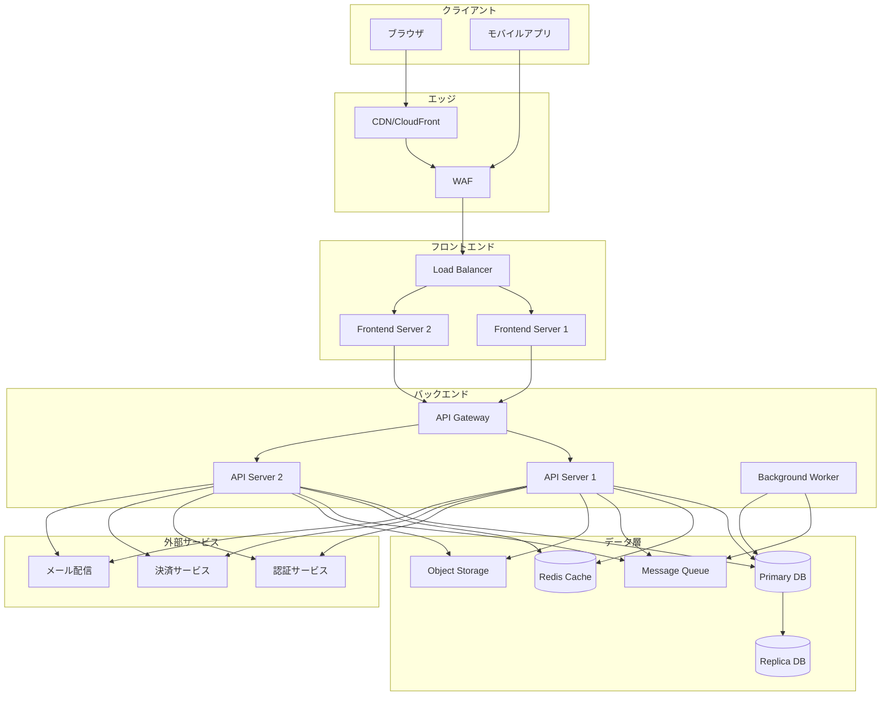
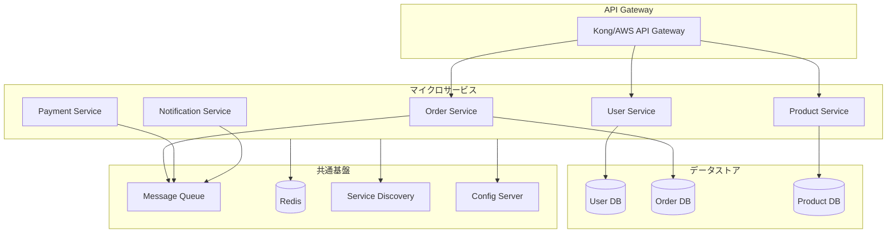
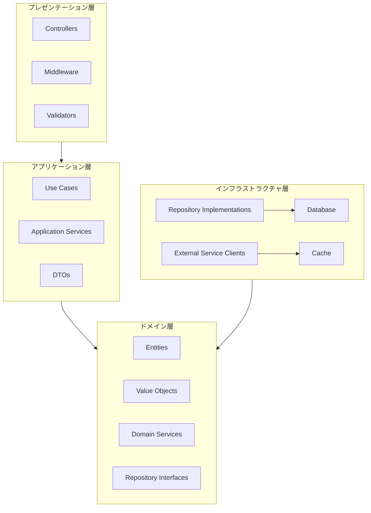
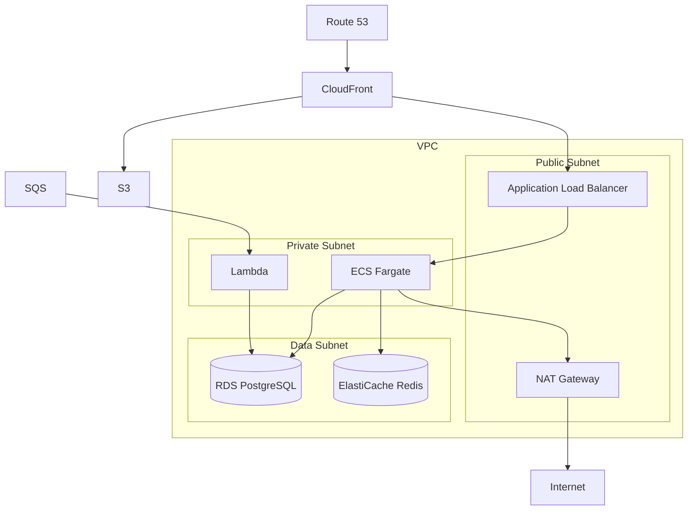

# アーキテクチャ設計リファレンス

## 1. システム構成図

### Webアプリケーション（標準構成）



### マイクロサービス構成



---

## 2. コンポーネント図

### レイヤードアーキテクチャ



### クリーンアーキテクチャ

```
┌─────────────────────────────────────────────────────┐
│                    Frameworks & Drivers              │
│  ┌─────────────────────────────────────────────┐    │
│  │              Interface Adapters              │    │
│  │  ┌─────────────────────────────────────┐    │    │
│  │  │         Application Business         │    │    │
│  │  │  ┌─────────────────────────────┐    │    │    │
│  │  │  │    Enterprise Business      │    │    │    │
│  │  │  │       (Entities)            │    │    │    │
│  │  │  └─────────────────────────────┘    │    │    │
│  │  │         (Use Cases)                  │    │    │
│  │  └─────────────────────────────────────┘    │    │
│  │    (Controllers, Gateways, Presenters)      │    │
│  └─────────────────────────────────────────────┘    │
│        (Web, DB, UI, External Interfaces)           │
└─────────────────────────────────────────────────────┘
```

---

## 3. ディレクトリ構造

### Webアプリケーション（モノレポ）

```
project/
├── apps/
│   ├── web/                    # フロントエンド
│   │   ├── src/
│   │   │   ├── components/
│   │   │   ├── pages/
│   │   │   ├── hooks/
│   │   │   ├── stores/
│   │   │   └── utils/
│   │   └── package.json
│   └── api/                    # バックエンド
│       ├── src/
│       │   ├── controllers/
│       │   ├── services/
│       │   ├── repositories/
│       │   ├── models/
│       │   └── middleware/
│       └── package.json
├── packages/
│   ├── shared/                 # 共通パッケージ
│   └── ui/                     # UIコンポーネント
├── docker/
├── docs/
└── package.json
```

### クリーンアーキテクチャ

```
src/
├── domain/                     # ドメイン層
│   ├── entities/
│   ├── value-objects/
│   ├── repositories/           # インターフェース
│   └── services/
├── application/                # アプリケーション層
│   ├── use-cases/
│   ├── dtos/
│   └── interfaces/
├── infrastructure/             # インフラ層
│   ├── database/
│   │   ├── repositories/       # 実装
│   │   └── migrations/
│   ├── external/
│   └── config/
└── presentation/               # プレゼンテーション層
    ├── controllers/
    ├── middleware/
    └── validators/
```

---

## 4. 技術選定マトリクス

### フロントエンド

| 要件 | React/Next.js | Vue/Nuxt | Angular |
|------|---------------|----------|---------|
| 大規模SPA | ◎ | ○ | ◎ |
| SSR/SSG | ◎ | ◎ | △ |
| 学習コスト | ○ | ◎ | △ |
| エコシステム | ◎ | ○ | ○ |
| TypeScript | ◎ | ○ | ◎ |

### バックエンド

| 要件 | Node.js | Python | Go | Java |
|------|---------|--------|-----|------|
| API性能 | ○ | ○ | ◎ | ○ |
| 開発速度 | ◎ | ◎ | ○ | △ |
| 型安全性 | ○(TS) | △ | ◎ | ◎ |
| 運用実績 | ◎ | ◎ | ○ | ◎ |
| ML/AI連携 | △ | ◎ | △ | ○ |

### データベース

| 要件 | PostgreSQL | MySQL | MongoDB |
|------|------------|-------|---------|
| ACID準拠 | ◎ | ◎ | △ |
| JSON対応 | ◎ | ○ | ◎ |
| スケーラビリティ | ○ | ○ | ◎ |
| 運用コスト | ○ | ◎ | ○ |

---

## 5. 非機能設計

### セキュリティ

| 項目 | 対策 |
|------|------|
| 認証 | JWT / OAuth 2.0 / OIDC |
| 認可 | RBAC / ABAC |
| 通信暗号化 | TLS 1.3 |
| データ暗号化 | AES-256 (at rest) |
| 入力検証 | サーバーサイドバリデーション |
| CSRF対策 | CSRFトークン |
| XSS対策 | Content Security Policy |
| SQLインジェクション | パラメータ化クエリ |

### パフォーマンス

| 項目 | 目標値 | 対策 |
|------|--------|------|
| API応答時間 | < 200ms (p95) | キャッシュ、クエリ最適化 |
| ページ読み込み | < 3秒 | CDN、コード分割、遅延読み込み |
| 同時接続数 | 1,000+ | 水平スケーリング |
| スループット | 1,000 req/s | ロードバランシング |

### 可用性

| 項目 | 目標値 | 対策 |
|------|--------|------|
| 稼働率 | 99.9% | 冗長構成、フェイルオーバー |
| RTO | < 1時間 | 自動復旧、バックアップ |
| RPO | < 5分 | レプリケーション |

---

## 6. インフラ構成

### AWS構成例



### Kubernetes構成例

```yaml
# 概念構成
Cluster:
  Namespace: production
    Deployments:
      - api-server (replicas: 3)
      - web-frontend (replicas: 2)
      - worker (replicas: 2)
    Services:
      - api-service (ClusterIP)
      - web-service (ClusterIP)
    Ingress:
      - nginx-ingress (LoadBalancer)
    ConfigMaps:
      - app-config
    Secrets:
      - db-credentials
      - api-keys
    PersistentVolumeClaims:
      - data-storage
```

---

## 7. 監視・ログ設計

### 監視項目

| カテゴリ | メトリクス | アラート閾値 |
|----------|-----------|-------------|
| インフラ | CPU使用率 | > 80% |
| インフラ | メモリ使用率 | > 85% |
| インフラ | ディスク使用率 | > 90% |
| アプリ | エラーレート | > 1% |
| アプリ | レイテンシ(p99) | > 1秒 |
| DB | コネクション数 | > 80% |
| DB | スロークエリ数 | > 10/分 |

### ログ設計

```json
{
  "timestamp": "2024-01-15T10:30:00.123Z",
  "level": "INFO",
  "service": "api-server",
  "trace_id": "abc123",
  "span_id": "def456",
  "user_id": "user_123",
  "method": "POST",
  "path": "/api/v1/orders",
  "status": 201,
  "duration_ms": 45,
  "message": "Order created successfully"
}
```
