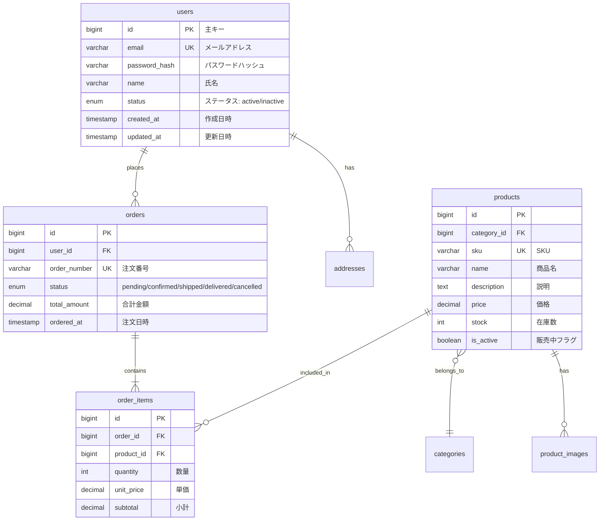

# データ設計リファレンス

## 1. ER図

### Mermaid記法



### リレーション表記

| 記号 | 意味 |
|------|------|
| `\|\|` | 1（必須） |
| `o\|` | 0または1 |
| `\|{` | 1以上 |
| `o{` | 0以上 |

---

## 2. テーブル定義書

### テンプレート

**テーブル名**: users
**論理名**: ユーザー
**説明**: システムのユーザー情報を管理

| No | カラム名 | 論理名 | データ型 | NULL | デフォルト | PK | FK | UK | 備考 |
|----|----------|--------|----------|------|-----------|-----|-----|-----|------|
| 1 | id | ID | BIGINT | NO | AUTO | ○ | - | - | - |
| 2 | email | メールアドレス | VARCHAR(255) | NO | - | - | - | ○ | - |
| 3 | password_hash | パスワード | VARCHAR(255) | NO | - | - | - | - | bcrypt |
| 4 | name | 氏名 | VARCHAR(100) | NO | - | - | - | - | - |
| 5 | status | ステータス | ENUM | NO | 'active' | - | - | - | active/inactive |
| 6 | created_at | 作成日時 | TIMESTAMP | NO | CURRENT | - | - | - | - |
| 7 | updated_at | 更新日時 | TIMESTAMP | NO | CURRENT | - | - | - | ON UPDATE |
| 8 | deleted_at | 削除日時 | TIMESTAMP | YES | NULL | - | - | - | 論理削除 |

**インデックス:**
| No | インデックス名 | カラム | 種類 | 備考 |
|----|---------------|--------|------|------|
| 1 | PRIMARY | id | PRIMARY | - |
| 2 | idx_users_email | email | UNIQUE | - |
| 3 | idx_users_status | status | INDEX | ステータス検索用 |

---

## 3. データ型ガイドライン

### PostgreSQL

| 用途 | データ型 | 例 |
|------|----------|-----|
| ID（主キー） | BIGSERIAL / UUID | id BIGSERIAL PRIMARY KEY |
| 文字列（短） | VARCHAR(n) | name VARCHAR(100) |
| 文字列（長） | TEXT | description TEXT |
| 整数 | INTEGER / BIGINT | quantity INTEGER |
| 金額 | DECIMAL(12,2) | price DECIMAL(12,2) |
| 真偽値 | BOOLEAN | is_active BOOLEAN |
| 日付 | DATE | birth_date DATE |
| 日時 | TIMESTAMP WITH TIME ZONE | created_at TIMESTAMPTZ |
| 列挙型 | ENUM / VARCHAR | status VARCHAR(20) |
| JSON | JSONB | metadata JSONB |

### MySQL

| 用途 | データ型 | 例 |
|------|----------|-----|
| ID（主キー） | BIGINT UNSIGNED AUTO_INCREMENT | id BIGINT UNSIGNED AUTO_INCREMENT |
| 文字列（短） | VARCHAR(n) | name VARCHAR(100) |
| 文字列（長） | TEXT / LONGTEXT | description TEXT |
| 整数 | INT / BIGINT | quantity INT |
| 金額 | DECIMAL(12,2) | price DECIMAL(12,2) |
| 真偽値 | TINYINT(1) / BOOLEAN | is_active TINYINT(1) |
| 日付 | DATE | birth_date DATE |
| 日時 | DATETIME / TIMESTAMP | created_at DATETIME |
| 列挙型 | ENUM | status ENUM('active','inactive') |
| JSON | JSON | metadata JSON |

---

## 4. 命名規則

### テーブル名

- snake_case
- 複数形（users, orders, products）
- 中間テーブル: {テーブル1}_{テーブル2}（user_roles）

### カラム名

- snake_case
- 主キー: id
- 外部キー: {参照テーブル単数形}_id（user_id）
- 日時: {動詞}_at（created_at, updated_at, deleted_at）
- フラグ: is_{形容詞}（is_active, is_deleted）

### インデックス名

```
{種類}_{テーブル名}_{カラム名}

種類:
- pk: 主キー
- uk: ユニーク
- idx: 通常インデックス
- fk: 外部キー

例:
- pk_users
- uk_users_email
- idx_users_status
- fk_orders_user_id
```

---

## 5. 共通カラム

すべてのテーブルに含める標準カラム：

| カラム名 | データ型 | 説明 |
|----------|----------|------|
| id | BIGINT | 主キー |
| created_at | TIMESTAMP | 作成日時 |
| updated_at | TIMESTAMP | 更新日時 |
| deleted_at | TIMESTAMP | 削除日時（論理削除） |

---

## 6. マスターデータ定義

### テンプレート

**テーブル名**: order_statuses
**論理名**: 注文ステータスマスタ

| コード | 名称 | 表示順 | 説明 |
|--------|------|--------|------|
| pending | 保留中 | 1 | 注文受付直後 |
| confirmed | 確認済 | 2 | 注文確認済み |
| processing | 処理中 | 3 | 出荷準備中 |
| shipped | 発送済 | 4 | 配送中 |
| delivered | 配達完了 | 5 | 配達完了 |
| cancelled | キャンセル | 9 | 注文キャンセル |

---

## 7. 正規化チェックリスト

### 第1正規形（1NF）
- [ ] すべてのカラムが原子的な値（繰り返しグループなし）
- [ ] 主キーが定義されている

### 第2正規形（2NF）
- [ ] 1NFを満たす
- [ ] 非キー属性が主キー全体に完全関数従属

### 第3正規形（3NF）
- [ ] 2NFを満たす
- [ ] 非キー属性間の推移的関数従属がない

### 非正規化の検討
以下の場合は意図的に非正規化を検討：
- パフォーマンスが重要な読み取り頻度の高いクエリ
- 履歴データの保存（スナップショット）
- 集計テーブル（サマリーテーブル）
