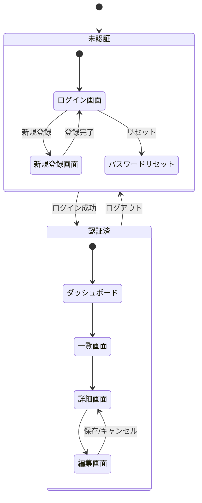

# 画面設計リファレンス

## 1. 画面一覧

### テンプレート

| 画面ID | 画面名 | 概要 | 権限 | 備考 |
|--------|--------|------|------|------|
| SCRN-001 | ログイン | 認証画面 | 全員 | - |
| SCRN-002 | ダッシュボード | メイン画面 | 認証済 | ホーム |
| SCRN-003 | ユーザー一覧 | ユーザー管理 | 管理者 | ページネーション |
| SCRN-004 | ユーザー詳細 | ユーザー情報表示 | 管理者 | 編集リンク |
| SCRN-005 | ユーザー編集 | ユーザー情報編集 | 管理者 | バリデーション |

### 画面ID命名規則

```
SCRN-{機能コード}{連番}

機能コード例:
- 0xx: 共通（認証、エラー等）
- 1xx: ユーザー管理
- 2xx: 商品管理
- 3xx: 注文管理
```

---

## 2. 画面遷移図

### Mermaid記法



---

## 3. 画面レイアウト

### ワイヤーフレーム記法（ASCII）

```
+--------------------------------------------------+
|  [Logo]              [検索]     [User▼] [通知]   |
+--------------------------------------------------+
|        |                                         |
| [Nav]  |  ┌─────────────────────────────────┐   |
|        |  │         ヘッダー領域             │   |
| ・ホーム|  └─────────────────────────────────┘   |
| ・一覧  |                                        |
| ・設定  |  ┌─────────────┐  ┌─────────────┐    |
|        |  │   カード1    │  │   カード2    │    |
|        |  │             │  │             │    |
|        |  └─────────────┘  └─────────────┘    |
|        |                                         |
|        |  ┌─────────────────────────────────┐   |
|        |  │        テーブル領域              │   |
|        |  │  [項目1] [項目2] [項目3] [操作]  │   |
|        |  │  ─────────────────────────────  │   |
|        |  │  データ行...                     │   |
|        |  └─────────────────────────────────┘   |
|        |                                         |
|        |  [< 前へ]  1 2 3 ... 10  [次へ >]      |
+--------------------------------------------------+
```

---

## 4. 画面項目定義

### テンプレート

**画面ID**: SCRN-003
**画面名**: ユーザー一覧

| No | 項目ID | 項目名 | 型 | 必須 | 入力/表示 | バリデーション | 備考 |
|----|--------|--------|-----|------|-----------|---------------|------|
| 1 | search_keyword | 検索キーワード | text | - | 入力 | 最大100文字 | 名前/メールで検索 |
| 2 | status_filter | ステータス | select | - | 入力 | - | 全て/有効/無効 |
| 3 | user_id | ID | number | - | 表示 | - | - |
| 4 | user_name | ユーザー名 | text | - | 表示 | - | リンク（詳細へ） |
| 5 | user_email | メールアドレス | email | - | 表示 | - | - |
| 6 | user_status | ステータス | badge | - | 表示 | - | 有効:緑/無効:赤 |
| 7 | created_at | 登録日 | date | - | 表示 | - | YYYY/MM/DD |
| 8 | action_edit | 編集 | button | - | 操作 | - | 編集画面へ |
| 9 | action_delete | 削除 | button | - | 操作 | - | 確認ダイアログ |

---

## 5. 画面イベント定義

### テンプレート

**画面ID**: SCRN-003

| No | イベントID | トリガー | 処理内容 | API | 遷移先 |
|----|-----------|----------|----------|-----|--------|
| 1 | EVT-001 | 画面表示 | 一覧取得 | GET /users | - |
| 2 | EVT-002 | 検索ボタン | 絞り込み検索 | GET /users?q={keyword} | - |
| 3 | EVT-003 | 編集ボタン | 編集画面遷移 | - | SCRN-005 |
| 4 | EVT-004 | 削除ボタン | 確認後削除 | DELETE /users/{id} | - |
| 5 | EVT-005 | ページ変更 | ページネーション | GET /users?page={n} | - |

---

## 6. 共通コンポーネント

### 一覧

| コンポーネントID | 名称 | 説明 |
|-----------------|------|------|
| CMP-001 | ヘッダー | ロゴ、検索、ユーザーメニュー |
| CMP-002 | サイドナビ | メインナビゲーション |
| CMP-003 | ページネーション | 一覧のページ切り替え |
| CMP-004 | 確認ダイアログ | 削除等の確認モーダル |
| CMP-005 | トースト通知 | 成功/エラー通知 |
| CMP-006 | ローディング | データ取得中表示 |
| CMP-007 | エラー画面 | 404/500エラー表示 |

---

## 7. レスポンシブ対応

### ブレークポイント

| 名称 | 幅 | 対象デバイス |
|------|-----|-------------|
| sm | < 640px | スマートフォン |
| md | 640px - 1024px | タブレット |
| lg | > 1024px | デスクトップ |

### レイアウト変化

| コンポーネント | lg | md | sm |
|---------------|-----|-----|-----|
| サイドナビ | 常時表示 | ハンバーガー | ハンバーガー |
| テーブル | 通常表示 | 横スクロール | カード形式 |
| グリッド | 4カラム | 2カラム | 1カラム |
