# Mermaid記法リファレンス

詳細設計で使用する主要なMermaid記法のリファレンス。

## 目次

1. [クラス図](#クラス図)
2. [シーケンス図](#シーケンス図)
3. [ER図](#er図)
4. [状態遷移図](#状態遷移図)
5. [フローチャート](#フローチャート)

---

## クラス図

### 基本構文

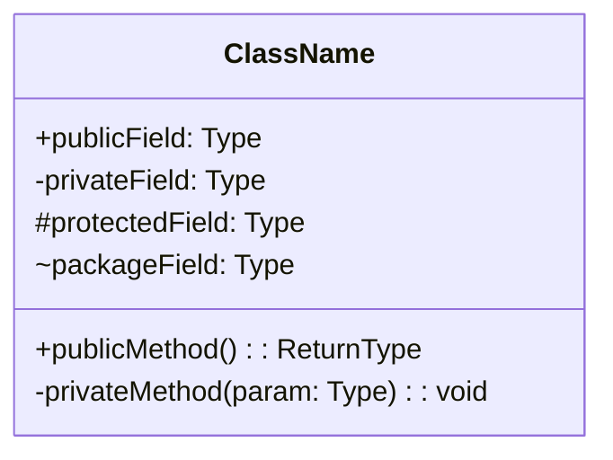

### アクセス修飾子

| 記号 | 意味 |
|------|------|
| `+` | public |
| `-` | private |
| `#` | protected |
| `~` | package/internal |

### 関係性

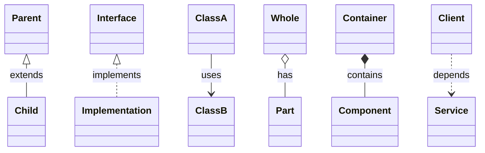

| 記法 | 意味 | 説明 |
|------|------|------|
| `<\|--` | 継承 | 子クラスが親クラスを継承 |
| `<\|..` | 実装 | クラスがインターフェースを実装 |
| `-->` | 関連 | クラス間の参照関係 |
| `o--` | 集約 | 弱い所有（ライフサイクル独立） |
| `*--` | コンポジション | 強い所有（ライフサイクル依存） |
| `..>` | 依存 | 一時的な利用関係 |

### 抽象クラス・インターフェース

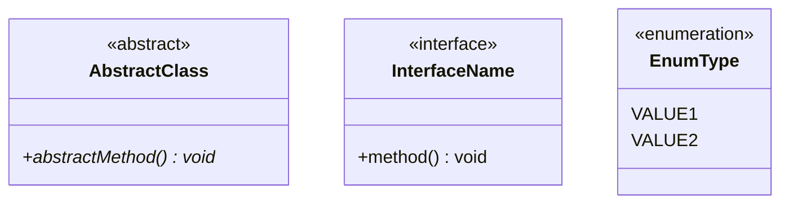

### 多重度

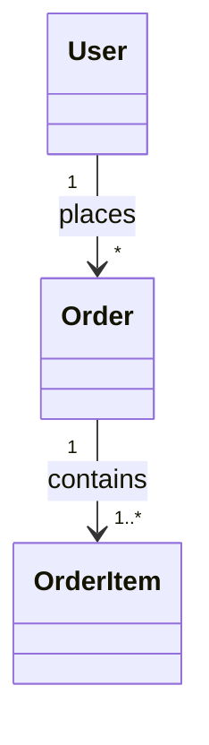

| 記法 | 意味 |
|------|------|
| `1` | 1つ |
| `0..1` | 0または1 |
| `*` | 0以上 |
| `1..*` | 1以上 |
| `n..m` | n以上m以下 |

---

## シーケンス図

### 基本構文

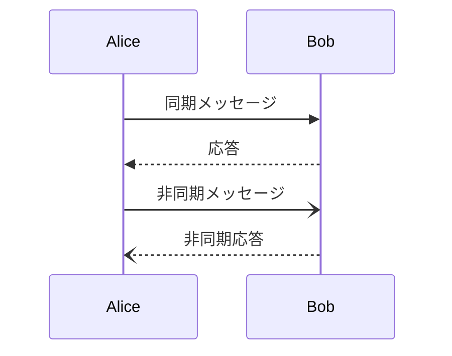

### メッセージタイプ

| 記法 | 説明 |
|------|------|
| `->>` | 同期メッセージ（実線矢印） |
| `-->>` | 同期応答（点線矢印） |
| `-)` | 非同期メッセージ（実線開き矢印） |
| `--)` | 非同期応答（点線開き矢印） |
| `-x` | メッセージ失敗（×印） |

### アクティベーション

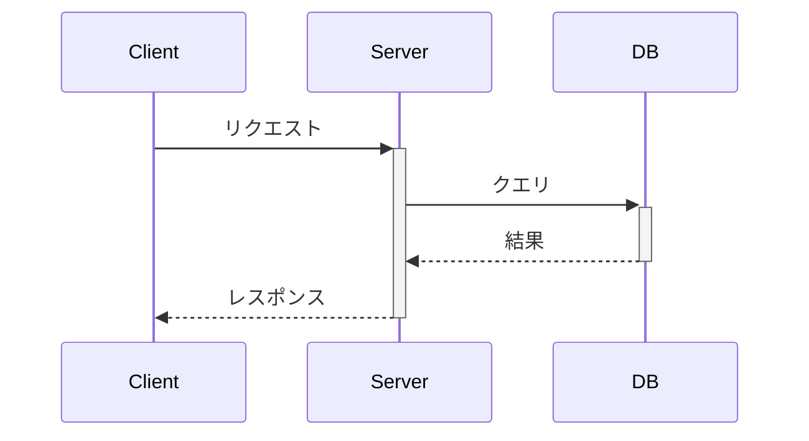

- `+` で開始、`-` で終了
- または `activate`/`deactivate` を使用

### 分岐・ループ

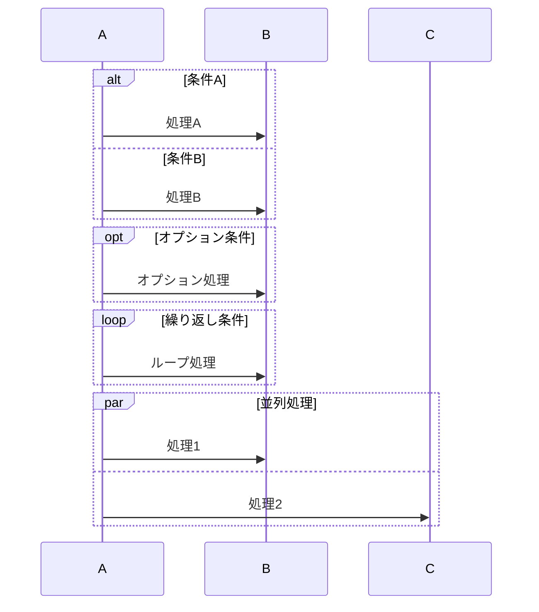

### ノート

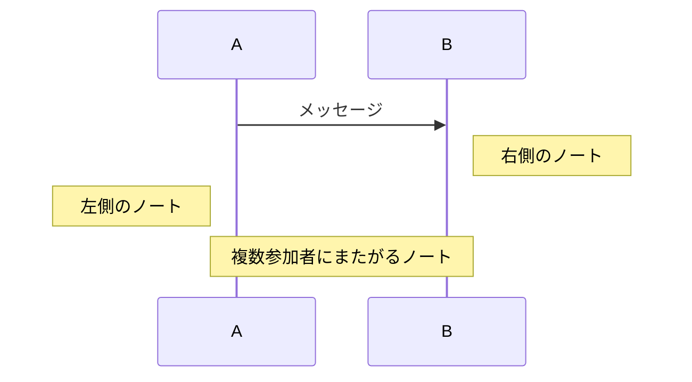

### 番号付け

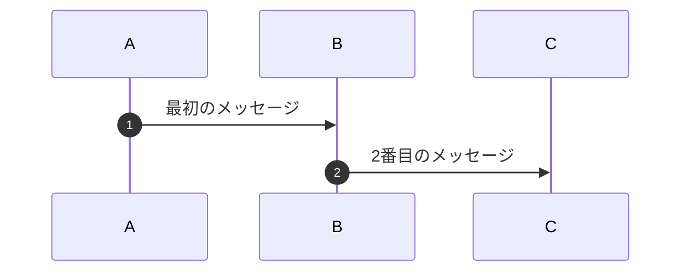

---

## ER図

### 基本構文

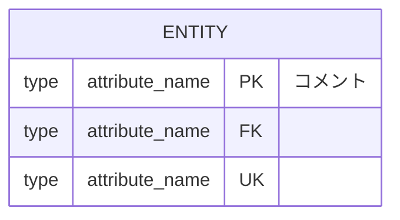

### 属性タイプ

| 記号 | 意味 |
|------|------|
| PK | Primary Key |
| FK | Foreign Key |
| UK | Unique Key |

### リレーションシップ

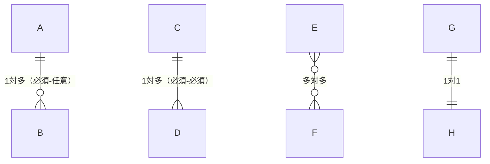

| 記法 | 意味 |
|------|------|
| `\|\|` | 1（必須） |
| `\|o` | 0または1 |
| `}o` | 0以上 |
| `}\|` | 1以上 |

### 完全な例

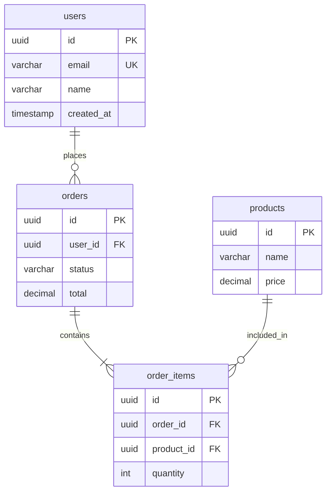

---

## 状態遷移図

### 基本構文

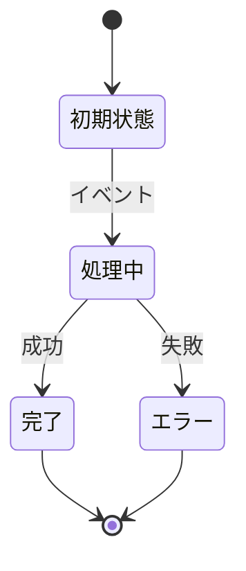

### 複合状態

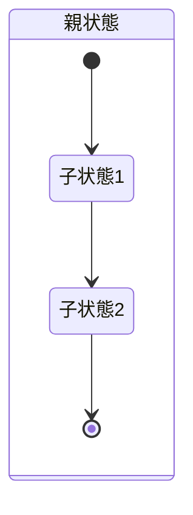

### 分岐・選択

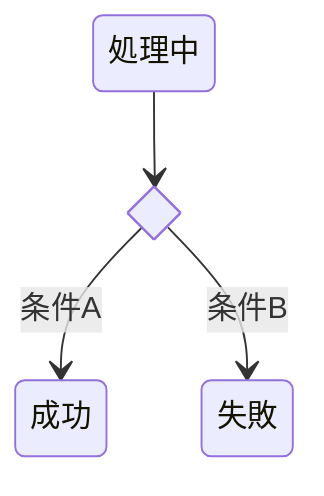

### 並行状態

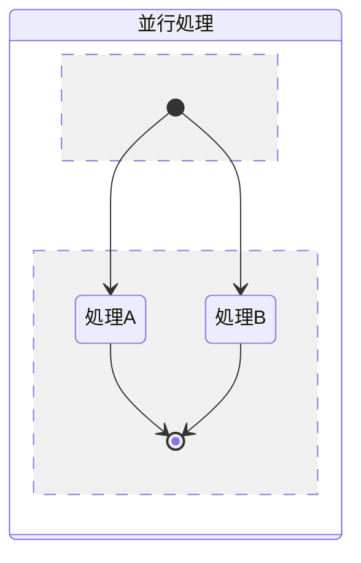

---

## フローチャート

### 基本構文

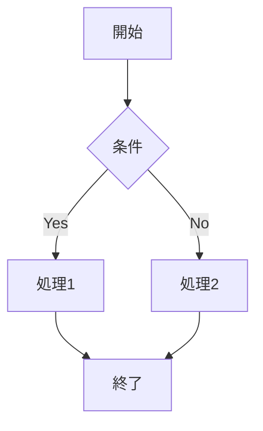

### 方向

| 記法 | 方向 |
|------|------|
| TD/TB | 上から下 |
| BT | 下から上 |
| LR | 左から右 |
| RL | 右から左 |

### ノード形状

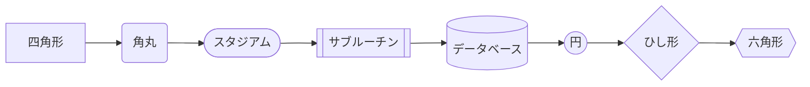

### サブグラフ

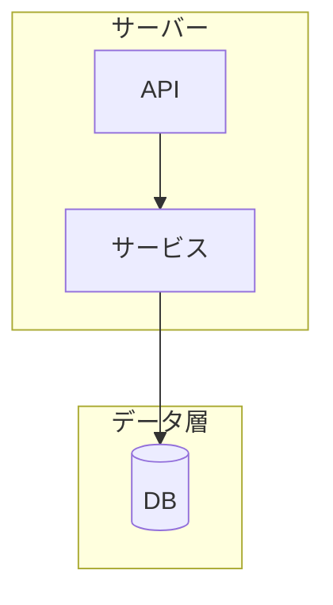
