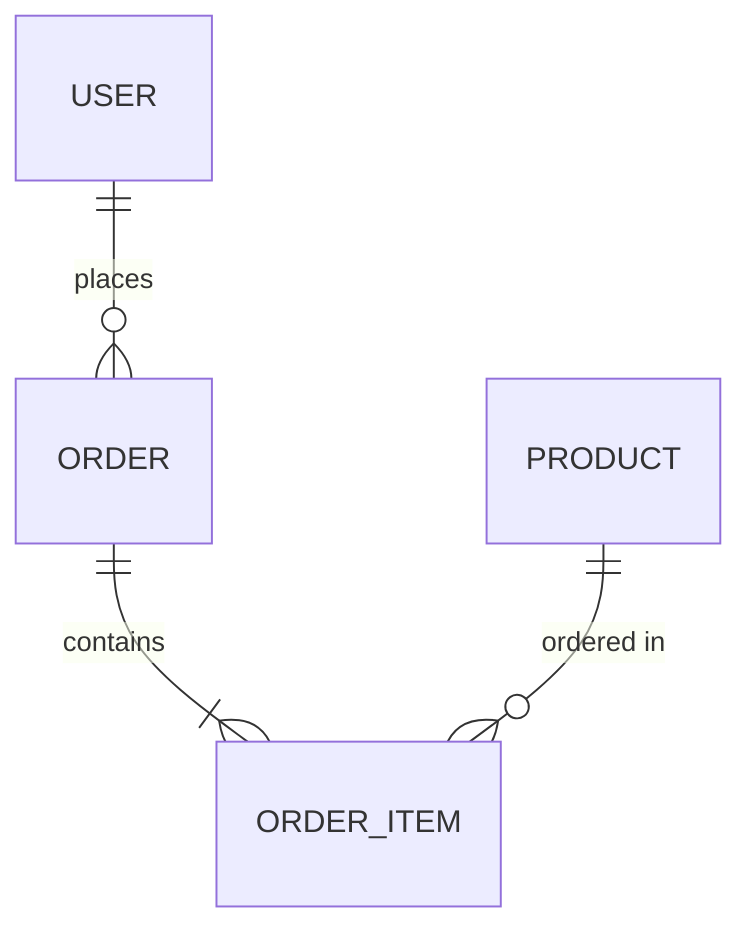
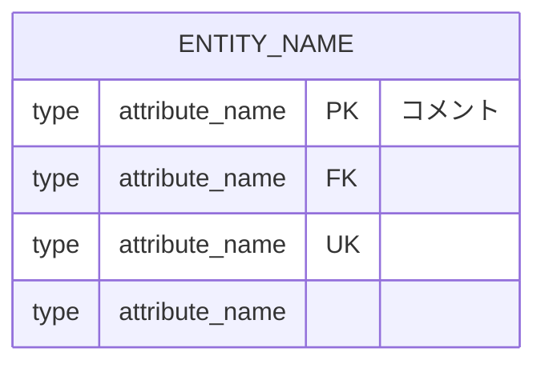
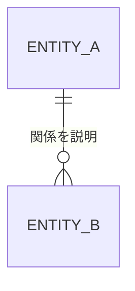
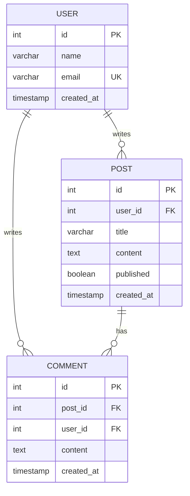
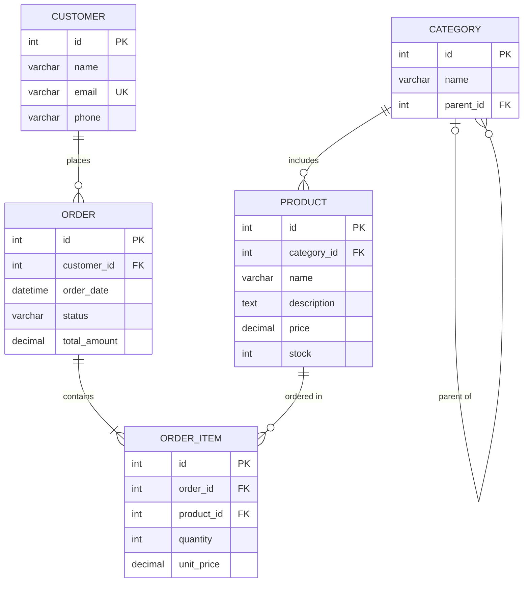
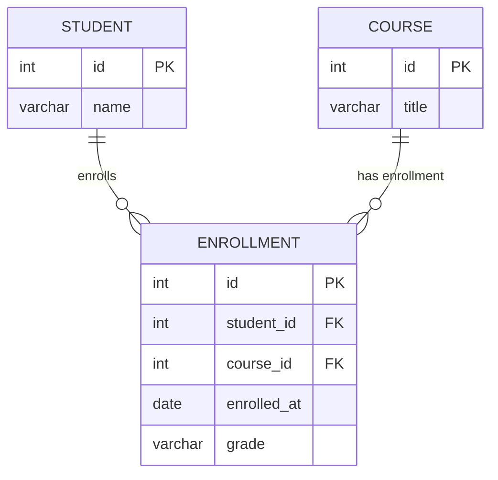

# ER図 Mermaid記法

## クイックスタート

```markdown

```

## 記法リファレンス

### エンティティと属性



| キー | 意味 |
|------|------|
| PK | 主キー |
| FK | 外部キー |
| UK | ユニークキー |

### データ型

一般的な型表記：

| 型 | 用途 |
|----|------|
| int | 整数 |
| bigint | 大きな整数 |
| varchar | 可変長文字列 |
| text | 長文テキスト |
| boolean | 真偽値 |
| date | 日付 |
| datetime | 日時 |
| timestamp | タイムスタンプ |
| decimal | 小数 |
| json | JSON |
| uuid | UUID |

### リレーションシップ記法

```
||--||  1対1（両側必須）
||--o|  1対1（右側オプション）
|o--o|  1対1（両側オプション）
||--|{  1対多（多側必須）
||--o{  1対多（多側オプション）
|o--|{  1対多（1側オプション、多側必須）
|o--o{  1対多（両側オプション）
}|--|{  多対多（両側必須）
}o--o{  多対多（両側オプション）
```

**記号の意味：**
- `||` : 1（必須）
- `|o` : 0または1（オプション）
- `|{` : 1以上（必須）
- `o{` : 0以上（オプション）

### リレーションシップラベル



ラベルは動詞または説明句を使用：
- `places`（発注する）
- `contains`（含む）
- `belongs to`（所属する）
- `has`（持つ）

## 実装パターン

### パターン1: シンプルなブログシステム



### パターン2: ECサイト



### パターン3: 多対多（中間テーブル）



## ベストプラクティス

1. **エンティティ名**: 大文字スネークケース（`USER`, `ORDER_ITEM`）
2. **属性名**: 小文字スネークケース（`user_id`, `created_at`）
3. **主キー**: 各テーブルに`id PK`を定義
4. **外部キー**: `参照先テーブル名_id FK`形式
5. **タイムスタンプ**: `created_at`, `updated_at`を必要に応じて追加
6. **リレーションラベル**: 英語の動詞または日本語の説明を使用

## 出力形式

ER図は以下の形式でマークダウンに記述：

````markdown
## データベース設計

### ER図

```mermaid
erDiagram
    ...
```

### テーブル定義

#### テーブル名

| カラム | 型 | 制約 | 説明 |
|--------|-----|------|------|
| id | int | PK | 主キー |
| ... | ... | ... | ... |
````
